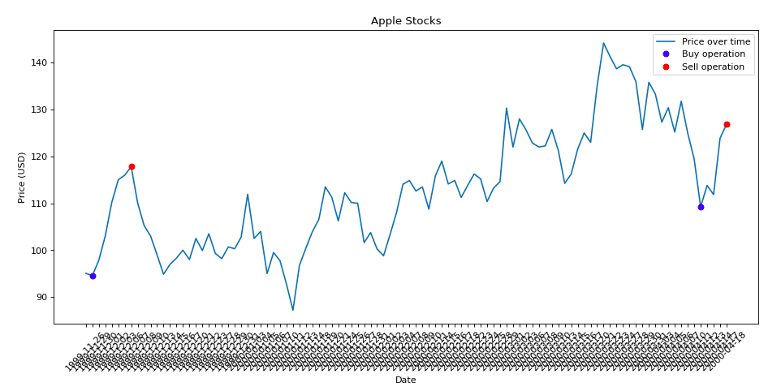

# Project 6 Google++

<h1 align="center">
   
    
   
</h1>

<h4 align="center"> Project 6 - Google Plus Plus </h4>

  <a href="#about-the-project">About the project</a> •
  <a href="#how-to-use">How To Use</a> •

## PRINTS / GIFS

  

**List Number**: 6 
**Course Content**: Grafos 

## Students
| Matrícula  | Aluno                              |
| ---------- | ---------------------------------- |
| 15/0150792 | Victor Moura                       |
| 16/0005191 | Durval Carvalho                    |

## About the project

This project was developed for the discipline
**Algorithm Project** of FGA College in the semester 02/2019.

This project aims to develop a autocompletion tool,
which will generate a word list according to the context
entered by the user.

The main objective was to develop an application that uses
**graph theory** and some other design paradigm (Greedy,
Dynamic Programming, divide to conquer)

## What we did

[Detailed Description about what we did]

## How To Use

[Detailed Description about how run the project]

created by [Durval Carvalho](https://github.com/durvalcarvalho) and [Victor Moura](https://github.com/victorcmoura)
