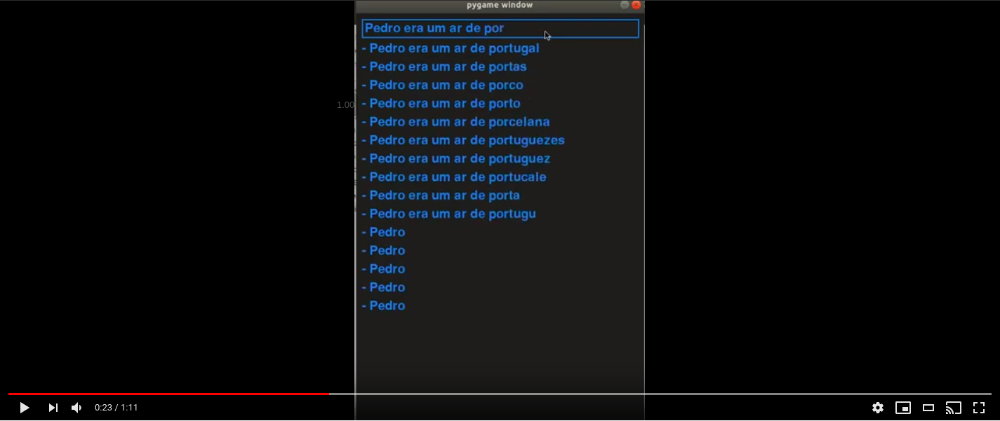

# Project 6 Google++

<h1 align="center">
  <br>
    <a href="static/logo.png">
      
    </a>
  <br>
</h1>

<h4 align="center"> Project 6 - Google Plus Plus </h4>

<p align="center">
  <a href="#about-the-project">About the project</a> •
  <a href="#how-to-use">How To Use</a> •
</p>

## Results

<p align="center">

  [](https://youtu.be/icYBiJe6IBM)

</p>

**List Number**: 6<br>
**Course Content**: Grafos (+ algum template)<br>

## Students
| Matrícula  | Aluno                              |
| ---------- | ---------------------------------- |
| 15/0150792 | Victor Moura                       |
| 16/0005191 | Durval Carvalho                    |

## About the project

This project was developed for the discipline
**Algorithm Project** of FGA College in the semester 02/2019.

This project aims to develop a **autocompletion tool**,
which will generate a word list according to the context
entered by the user.

The main objective was to develop an application that uses
**graph theory** and some other design paradigm (Greedy,
Dynamic Programming, divide to conquer)

## What we did

This project was based on 2 other projects.

The first is the [autocomplete](https://github.com/rodricios/autocomplete) developed by [rodricios](https://github.com/rodricios/). In this project, an autocompletion is developed based on the stochastic model [Markov chain](https://en.wikipedia.org/wiki/Markov_chain) where each word is likely to occur according to its predecessors.

The second project is the [fast-autocomplete](https://github.com/wearefair/fast-autocomplete) developed by [wearefair](https://github.com/wearefair). In this project an autofill is developed using a
Directed Word Graph ([DWG](https://thedeveloperblog.com/directed-acyclic-word-graph)) and [Levenshtein distance](https://en.wikipedia.org/wiki/Levenshtein_distance).

Based on these two projects an autocomplete was developed that accepts small typos, which understands the context and calculates the probability of the next word.

## How To Use

```bash
# Clone this repository
$ git clone https://github.com/projeto-de-algoritmos-2019-2/project-6-google-plus-plus google-plus-plus

# Install virtualenv
$ sudo pip3 install virtualenv

# Create a env
$ virtualenv -p python3 env

# Activate the env
$ source env/bin/activate

# Install the requirements
$ pip install -r requirements.txt

# get in google-plus-plus directory
$ cd google-plus-plus

# Run the application
$ python app.py
```

created by [Durval Carvalho](https://github.com/durvalcarvalho) and [Victor Moura](https://github.com/victorcmoura)
